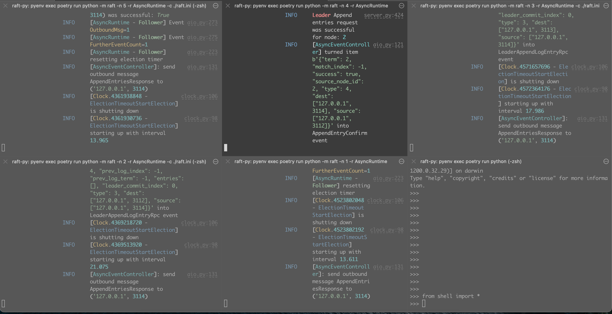
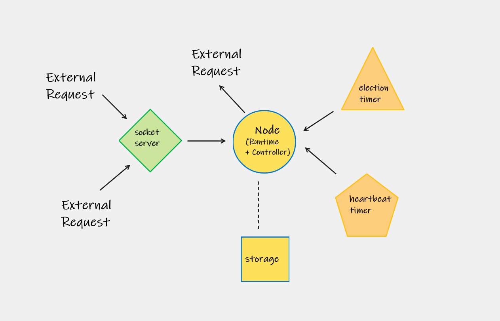

# Raft In Python

This is a work-in-progress attempt to implement Raft in Python. This codebase represents a personal exploration of the problem of Raft, so it's not intended as a model or complete implementation.

Inspiration for this project has come from the original Raft paper. This project uses the following Python libraries:

- `trio`
- `rich`

## Running

You can install dependencies with `poetry`:

```sh
$ poetry install
```

After that, to run this using the provided `ini` file, you can invoke it using a node-id from 1 to 5:

```sh
$ python -m raft -c raft.ini -n 2
[04/07/22 07:09:33] WARNING  [AsyncRuntime -     aio.py:312
                             Follower] Starting
                             up now
                    INFO     [AsyncEventControll aio.py:113
                             er] Start: process
                             inbound messages
                    WARNING  [AsyncRuntime -     aio.py:287
                             Follower]: event
                             handler processing
                             started
                    INFO     SocketSe transport_async.py:68
                             rver
                             Start: l
                             istening
                              at 127.
                             0.0.1:31
                             11
                    INFO     [AsyncRuntime -     aio.py:242
                             Follower]
                             Converting to
                             Follower
                    INFO     [AsyncRuntime -     aio.py:223
                             Follower] resetting
                             election timer
                    INFO     [AsyncRuntime -     aio.py:268
                             Follower] Handling
                             event: EventType=Co
                             nversionToFollower
                             MsgType=none
                    INFO     [Clock.4439667616  clock.py:98
                             - ElectionTimeoutS
                             tartElection]
                             starting up with
                             interval 21.273
^C[04/07/22 07:09:34] WARNING  SHUTTING DOWN   __main__.py:57
                    WARNING  PLEASE WAIT FOR __main__.py:58
                             FULL STOP
                    WARNING  [AsyncRuntime -     aio.py:317
                             Follower] Shutting
                             down now
```

By default, the `AsyncRuntime` will be used, but there is also a `ThreadedRuntime` provided:

```sh
$ python -m raft -c raft.ini -n 2 -r ThreadedRuntime
[04/07/22 07:11:23] WARNING  [ThreadedRuntime - Follower] is     threaded.py:293
                             starting in DEBUG mode
                    WARNING  [ThreadedRuntime - Follower] will   threaded.py:294
                             run in the foreground
                    INFO     [ThreadedEventController] Start:     threaded.py:84
                             process inbound messages
                    INFO     [ThreadedEventController] Start:    threaded.py:103
                             process outbound messages
                    WARNING  [ThreadedRuntime - Follower] Start: threaded.py:268
                             primary event handler
                    INFO     [ThreadedRuntime - Follower]        threaded.py:224
                             Converting to Follower
                    INFO     [ThreadedRuntime - Follower]        threaded.py:206
                             resetting election timer
                    INFO     [Clock.4403522688 -                     clock.py:53
                             ElectionTimeoutStartElection] starting
                             up with interval 12.245
                    INFO     [ThreadedRuntime - Follower]        threaded.py:250
                             Handling event:
                             EventType=ConversionToFollower
                             MsgType=none
^C                    WARNING  SHUTTING DOWN                        __main__.py:57
                    WARNING  PLEASE WAIT FOR FULL STOP            __main__.py:58
                    INFO     [Clock.4403522688 -                     clock.py:57
                             ElectionTimeoutStartElection] is
                             shutting down
                    INFO     [ThreadedEventController] Stop:     threaded.py:115
                             process outbound messages
```

**Note**: At this time the `AsyncRuntime` is better with resources and easier to shutdown, so it's preferred over the `ThreadedRuntime`.

You can simultaneously run raft nodes in other terminals. If you have enough for quorum, one of these will be elected leader. Here's scree shot of five terminal sessions where a `Leader` is sending heartbeats to the other nodes in the cluster:



To send requests into the cluster see the examples in [`shell.py`](./shell.py).

## Design

This codebase splits up the Raft protocol into a few important pieces

- Socket Server (for receiving requests)
- Runtime
  - Event Controller
  - Event Handler
- Server
- Storage
- Clocks

This diagram may help:



The event controller and event handler use queues or channels to coordinate behavior between the socket server and the clocks that a Raft node may need to run.

## To Do

This is a work-in-progress built for learning, so there are many things left to do:

- Tests
- Log Storage on Disk
- Snapshot cluster state on Disk
- More efficient message-serialization
- Try other transports and messaging-patterns instead of raw sockets (ZeroMQ and/or fanout, for instance)
- Allow nodes to join or leave cluster
- Construct database or reuse existing
